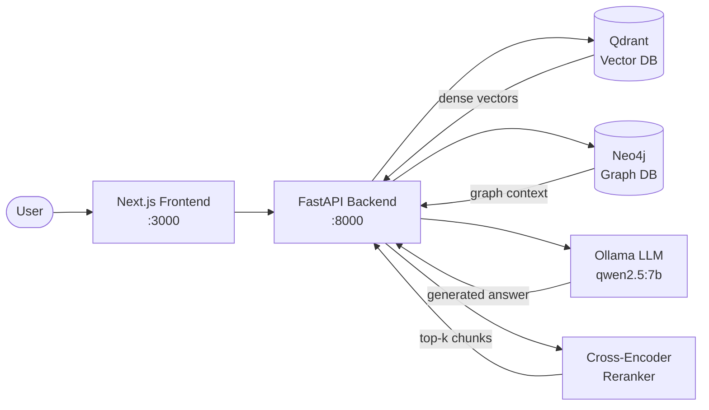
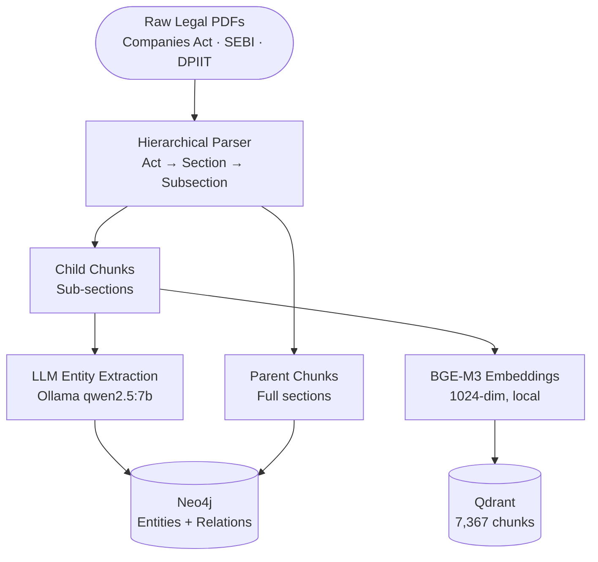
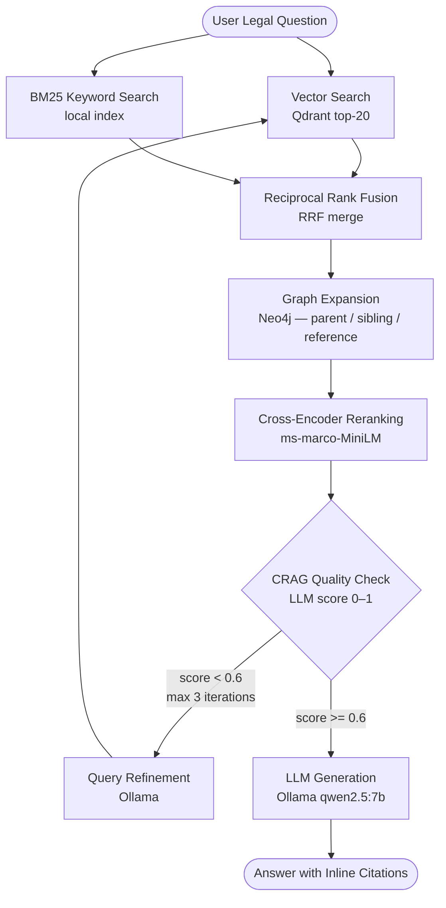

# Clause

A production-grade, fully local Legal GraphRAG system for Indian Corporate Law — built on hybrid retrieval, knowledge graph expansion, and a Corrective RAG (CRAG) quality loop.

Corpus: Companies Act 2013, SEBI AIF Regulations 2012, DPIIT Startup Guidelines.

---

## System Architecture



A Next.js frontend communicates with a FastAPI backend that orchestrates hybrid retrieval across Qdrant (dense vectors) and Neo4j (knowledge graph), with answer generation via a local Ollama LLM instance.

---

## Pipeline

### Ingestion



Raw legal PDFs are parsed hierarchically (Act → Section → Subsection) into parent/child chunk pairs. Child chunks are embedded with `BAAI/bge-m3` and stored in Qdrant. In parallel, an LLM extracts legal entities and relationships into a Neo4j knowledge graph.

**Corpus stats:** 3 acts · 7,367 child chunks · 1,024-dim embeddings

### Query & CRAG Loop



Every query runs through a 6-stage pipeline:

1. **Hybrid Retrieval** — Qdrant vector search + BM25 keyword search fused via Reciprocal Rank Fusion (RRF)
2. **Graph Expansion** — Neo4j traversal fetches structurally related legal sections (parent/sibling/reference)
3. **Reranking** — Cross-encoder scores all candidates; top-k are selected
4. **CRAG Check** — LLM evaluates context quality (score 0–1). If score < 0.6, the query is refined and retrieval restarts (max 3 iterations)
5. **Generation** — Final context passed to Ollama with a structured legal reasoning prompt
6. **Citation Extraction** — Inline citations parsed from the answer and surfaced to the UI

---

## Evaluation

Evaluated using RAGAS-style metrics with an Ollama CoT judge against a 20-question expert-annotated ground truth dataset (4 categories: Simple, Multi-hop, Cross-document, Conditional).

### Ablation Study

| Metric | Naive RAG | Advanced RAG | Clause Full |
|---|---|---|---|
| Faithfulness | 0.610 | 0.585 | **0.642** |
| Answer Relevancy | 0.940 | **0.945** | 0.910 |
| Context Precision | **0.600** | 0.550 | 0.560 |
| Context Recall | 0.338 | **0.342** | 0.241 |
| Avg Latency | **3.8s** | 11.9s | 24.3s |

**Variants:**
- `Naive RAG` — vector-only retrieval, no graph, no CRAG, no reranking
- `Advanced RAG` — hybrid (vector + BM25 + RRF) + cross-encoder reranking
- `Clause Full` — all of the above + Neo4j graph expansion + CRAG loop

### Key Finding

`Clause Full` achieves the highest faithfulness (+5.2% over naive baseline) by trading broad recall for strict answer grounding. The CRAG loop detects low-quality context and prevents the LLM from generating unsupported answers — a deliberate design choice for the legal domain where hallucination is unacceptable.

### CRAG Self-Assessment (Clause Full)

| Question Category | Avg CRAG Score |
|---|---|
| Simple | 0.70 |
| Multi-hop | 0.62 |
| Cross-document | 0.54 |
| Conditional | 0.58 |

---

## Stack

| Layer | Technology |
|---|---|
| Backend | FastAPI, Python 3.11, Uvicorn |
| Frontend | Next.js 16, React 19, Tailwind CSS v3 |
| Vector Store | Qdrant v1.18 (Docker) |
| Knowledge Graph | Neo4j v5.20 Community (Docker) |
| LLM | Ollama — qwen2.5:7b |
| Embeddings | BAAI/bge-m3 (1024-dim, local) |
| Reranker | cross-encoder/ms-marco-MiniLM-L-6-v2 |

Entirely local — no external API calls required.

---

## Getting Started

### Prerequisites

- Docker + Docker Compose
- Python 3.11+
- Node.js v20+
- Ollama with `qwen2.5:7b` pulled (`ollama pull qwen2.5:7b`)

### 1. Start infrastructure

```bash
sudo docker compose up -d
```

### 2. Backend

```bash
python -m venv venv && source venv/bin/activate
pip install -r requirements.txt
uvicorn clause.api.main:app --reload
# API: http://localhost:8000
```

### 3. Frontend

```bash
cd frontend
npm install
npm run dev
# UI: http://localhost:3000
```

### 4. Run evaluation (optional)

```bash
# Full ablation benchmark — all 3 variants, 20 questions
python scripts/run_eval.py --all

# Single variant, skip RAGAS scoring (fast mode)
python scripts/run_eval.py --variant clause_full --skip-ragas
```

---

## Repository Structure

```
clause-rag-v1/
├── clause/
│   ├── api/            # FastAPI routes and Pydantic schemas
│   ├── ingestion/      # PDF parsing, embedding, graph extraction
│   ├── retrieval/      # Hybrid search, RRF, graph expansion, reranking
│   ├── generation/     # LLM generation, CRAG check, query refinement
│   └── evaluation/     # RAGAS metrics, ablation benchmark
├── data/
│   ├── raw/            # Source legal documents
│   ├── processed/      # Parsed chunks and enriched JSON
│   └── eval/           # Questions, ground truth, results
├── frontend/           # Next.js web application
├── docs/               # Architecture diagrams
├── scripts/            # CLI utilities and eval runner
├── context/            # Detailed design documentation per component
└── docker-compose.yml
```

---

## License

MIT