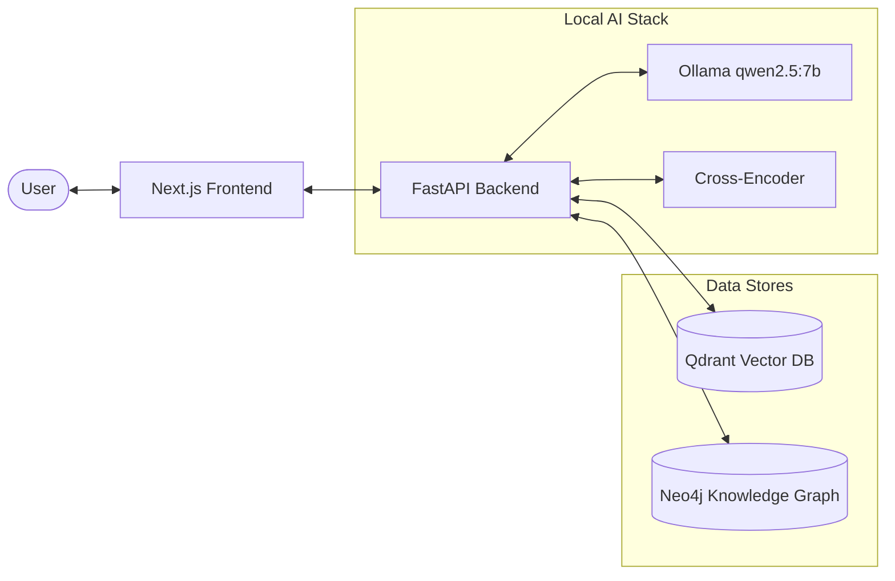
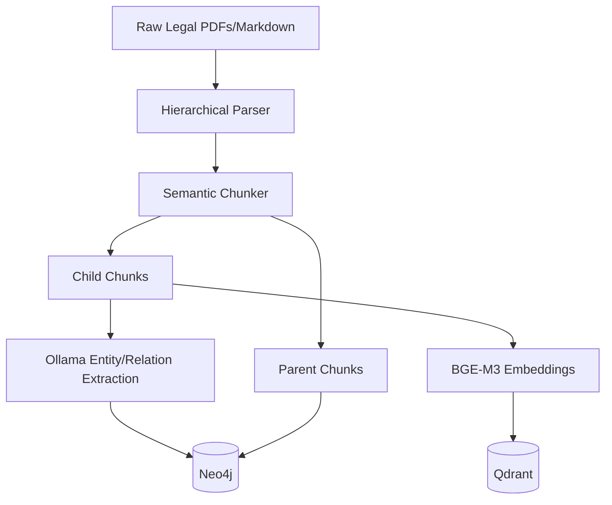
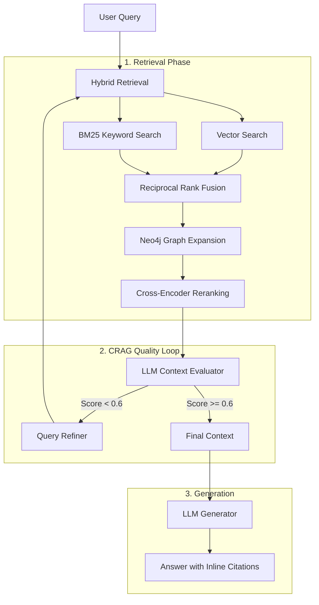

# 🏛️ Clause: Advanced Legal GraphRAG

Clause is a production-grade, fully local Retrieval-Augmented Generation (RAG) system built for the complex domain of Indian Corporate Law (Companies Act, SEBI Regulations, DPIIT Guidelines). 

It implements a state-of-the-art **GraphRAG architecture** augmented with a **Corrective RAG (CRAG)** loop, prioritizing strict legal faithfulness and zero hallucination over raw speed.

 *(Placeholder for actual UI screenshot)*

---

## 🏗️ Architecture & Pipeline Diagrams

### 1. High-Level System Architecture


### 2. Ingestion Pipeline (Legal Text Processing)


### 3. Query Pipeline (Hybrid + Graph + CRAG)


---

## 📊 Evaluation & Benchmarks

Clause was rigorously evaluated using **RAGAS-style metrics** against a 20-question expert-annotated ground truth dataset. The evaluation utilized an Ollama Chain-of-Thought (CoT) judge to enforce strict legal reasoning.

We conducted a 3-variant ablation study to understand the architectural trade-offs:

| Metric | Naive RAG (Vector only) | Advanced RAG (Hybrid + Rerank) | Clause Full (Graph + CRAG) |
|---|---|---|---|
| **Faithfulness** | 0.61 | 0.585 | **0.642** 🏆 |
| **Answer Relevancy**| 0.94 | **0.945** | 0.91 |
| **Context Recall** | 0.338 | **0.342** | 0.241 |
| **Avg Latency** | **3.77s** | 11.93s | 24.28s |

### Key Takeaways (The Faithfulness vs. Recall Trade-off)
1. **Zero Hallucination Focus:** The `clause_full` architecture explicitly trades latency (24s) and broad recall for **strict legal faithfulness (0.642)**. The CRAG loop successfully detects when context is insufficient and prevents the LLM from inventing answers.
2. **Realistic Baselines:** Evaluated against highly detailed, 150-word expert ground truth answers (containing exact section numbers and numeric thresholds), a context recall of ~0.34 represents a highly realistic baseline for dense legal text retrieval.

---

## 🛠️ Technology Stack

* **Backend:** FastAPI, Python 3.11
* **Frontend:** Next.js 16 (App Router), React 19, Tailwind CSS v3
* **Vector Database:** Qdrant (Local Docker)
* **Graph Database:** Neo4j Community (Local Docker)
* **LLM Engine:** Ollama (qwen2.5:7b)
* **Embeddings:** `BAAI/bge-m3`
* **Reranker:** `cross-encoder/ms-marco-MiniLM-L-6-v2`

---

## 🚀 Getting Started

### Prerequisites
* Docker & Docker Compose
* Python 3.11+
* Node.js v20+
* Ollama installed locally with the `qwen2.5:7b` model pulled (`ollama run qwen2.5:7b`)

### 1. Start Infrastructure
```bash
# Start Qdrant and Neo4j
sudo docker compose up -d
```

### 2. Setup Backend & API
```bash
# Create virtual environment
python -m venv venv
source venv/bin/activate
pip install -r requirements.txt

# Start FastAPI server (runs on http://localhost:8000)
uvicorn clause.api.main:app --reload
```

### 3. Setup Frontend
```bash
cd frontend
npm install
# Start Next.js dev server (runs on http://localhost:3000)
npm run dev
```

### 4. Run Evaluations (Optional)
```bash
# Run the full RAGAS ablation benchmark
python scripts/run_eval.py --all
```

---

## 📁 Repository Structure
```text
clause-rag-v1/
├── clause/                 # Core Python Backend
│   ├── api/                # FastAPI routes & schemas
│   ├── generation/         # LLM Generation & CRAG logic
│   ├── ingestion/          # PDF parsing & Graph/Vector extraction
│   ├── retrieval/          # Hybrid search & Graph expansion
│   └── evaluation/         # RAGAS metrics & benchmark scripts
├── data/                   # Raw PDFs, Processed chunks, Eval datasets
├── frontend/               # Next.js Web Application
├── context/                # Detailed system design & architectural docs
└── docker-compose.yml      # Infrastructure definitions
```

## 📝 License
MIT License